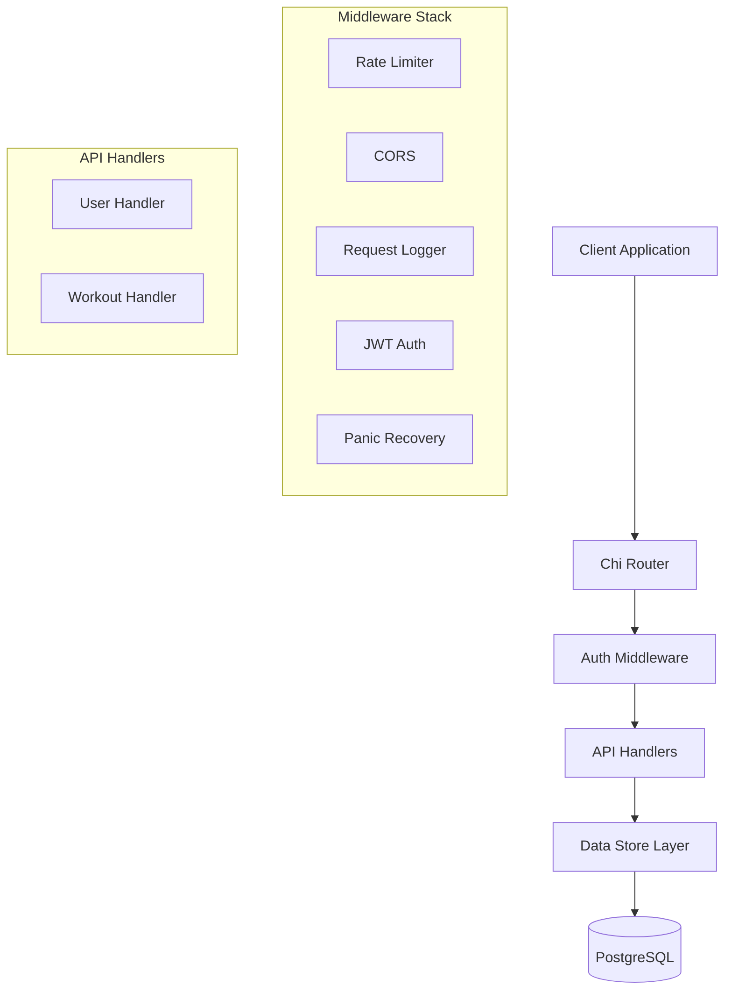

# 🏋️‍♂️ Workout Tracker API

<div align="center">


*A robust, JWT-authenticated REST API for tracking workouts and exercises*

[Features](#-features) • [Quick Start](#-quick-start) • [API Documentation](#-api-documentation) • [Contributing](#-contributing)

</div>

---

## 📋 Table of Contents

- [✨ Features](#-features)
- [🚀 Quick Start](#-quick-start)
- [🏗️ Architecture](#️-architecture)
- [📖 API Documentation](#-api-documentation)
- [🔧 Configuration](#-configuration)
- [🧪 Testing](#-testing)
- [🐳 Docker Setup](#-docker-setup)
- [📁 Project Structure](#-project-structure)
- [🤝 Contributing](#-contributing)
- [📄 License](#-license)

## ✨ Features

<table>
<tr>
<td width="50%">

### 🔐 **Authentication & Security**
- JWT-based authentication
- Bcrypt password hashing
- User registration and login
- Protected routes with middleware
- Rate limiting (100 req/min)

</td>
<td width="50%">

### 🏋️ **Workout Management**
- Create, read, update, delete workouts
- Detailed exercise tracking
- Sets, reps, weight, and duration logging
- Custom workout notes
- User-specific workout isolation

</td>
</tr>
<tr>
<td width="50%">

### 🛠️ **Technical Stack**
- **Backend**: Go 1.24.2
- **Router**: Chi v5
- **Database**: PostgreSQL 12.4+
- **Migrations**: Goose
- **Testing**: Testify
- **Containerization**: Docker & Docker Compose

</td>
<td width="50%">

### 📊 **Data & Analytics**
- Workout duration tracking
- Calories burned estimation
- Exercise progression monitoring
- Structured workout entries
- Comprehensive logging

</td>
</tr>
</table>

## 🚀 Quick Start

### Prerequisites

Before you begin, ensure you have the following installed:
- [Go](https://golang.org/doc/install) (version 1.24.2 or later)
- [Docker](https://docs.docker.com/get-docker/) and [Docker Compose](https://docs.docker.com/compose/install/)
- [Git](https://git-scm.com/downloads)

### Installation

1. **Clone the repository**
   ```bash
   git clone https://github.com/LikhithMar14/workout-tracker.git
   cd workout-tracker
   ```

2. **Start PostgreSQL with Docker**
   ```bash
   docker-compose up -d db
   ```

3. **Install dependencies**
   ```bash
   go mod download
   ```

4. **Run the application**
   ```bash
   go run cmd/main.go
   ```

The API will be available at `http://localhost:8080` 🎉

### Health Check

```bash
curl http://localhost:8080/health
# Response: Status is available
```

## 🏗️ Architecture



### Key Components

| Component | Description |
|-----------|-------------|
| **Chi Router** | High-performance HTTP router with middleware support |
| **JWT Authentication** | Secure token-based authentication system |
| **PostgreSQL** | Reliable relational database with ACID compliance |
| **Goose Migrations** | Database schema versioning and migration management |
| **Docker Compose** | Container orchestration for development and testing |

## 📖 API Documentation

### Authentication Endpoints

#### Register User
```http
POST /register
Content-Type: application/json

{
  "username": "johndoe",
  "email": "john@example.com",
  "password": "securepassword123",
  "bio": "Fitness enthusiast"
}
```

**Response:**
```json
{
  "user": {
    "id": 1,
    "username": "johndoe",
    "email": "john@example.com",
    "bio": "Fitness enthusiast",
    "created_at": "2024-01-15T10:00:00Z"
  },
  "token": "eyJhbGciOiJIUzI1NiIsInR5cCI6IkpXVCJ9..."
}
```

#### Login User
```http
POST /login
Content-Type: application/json

{
  "username": "johndoe",
  "email": "john@example.com",
  "password": "securepassword123"
}
```

### Workout Endpoints

> 🔒 **Note**: All workout endpoints require authentication. Include the JWT token in the Authorization header:
> ```
> Authorization: Bearer <your-jwt-token>
> ```

#### Create Workout
```http
POST /workouts
Authorization: Bearer <token>
Content-Type: application/json

{
  "title": "Push Day",
  "description": "Upper body strength training",
  "duration_minutes": 75,
  "calories_burned": 350,
  "entries": [
    {
      "exercise_name": "Bench Press",
      "sets": 4,
      "reps": 8,
      "weight": 185.5,
      "notes": "Felt strong today",
      "order_index": 1
    },
    {
      "exercise_name": "Incline Dumbbell Press",
      "sets": 3,
      "reps": 12,
      "weight": 75.0,
      "order_index": 2
    }
  ]
}
```

#### Get Workout
```http
GET /workouts/{id}
Authorization: Bearer <token>
```

#### Update Workout
```http
PUT /workouts/{id}
Authorization: Bearer <token>
Content-Type: application/json

{
  "title": "Updated Push Day",
  "duration_minutes": 80,
  "entries": [...]
}
```

#### Delete Workout
```http
DELETE /workouts/{id}
Authorization: Bearer <token>
```

### Response Codes

| Code | Description |
|------|-------------|
| `200` | ✅ Success |
| `201` | ✅ Created |
| `204` | ✅ No Content |
| `400` | ❌ Bad Request |
| `401` | 🔒 Unauthorized |
| `404` | 🔍 Not Found |
| `429` | 🚦 Rate Limited |
| `500` | 💥 Internal Server Error |

## 🔧 Configuration

### Command Line Flags

The application supports various configuration options via command-line flags:

```bash
go run cmd/main.go \
  -port=8080 \
  -host=localhost \
  -user=postgres \
  -password=postgres \
  -dbname=postgres \
  -dbport=5432 \
  -sslmode=disable
```

### Environment Variables

For production deployment, consider using environment variables:

```bash
export DB_HOST=your-postgres-host
export DB_USER=your-username
export DB_PASSWORD=your-password
export DB_NAME=your-database
export JWT_SECRET=your-secret-key
```

## 🧪 Testing

### Run Tests

```bash
# Run all tests
go test ./...

# Run tests with coverage
go test -cover ./...

# Run specific package tests
go test ./internal/store/...
```

### Test Database Setup

The project includes a separate test database configuration:

```bash
# Start test database
docker-compose up -d test_db

# Run tests against test database
go test ./internal/store/ -v
```

### Sample Test Data

<details>
<summary>Click to expand sample workout data</summary>

```json
{
  "title": "Full Body Workout",
  "description": "Complete body strength training",
  "duration_minutes": 90,
  "calories_burned": 500,
  "entries": [
    {
      "exercise_name": "Squats",
      "sets": 4,
      "reps": 12,
      "weight": 225.0,
      "notes": "Full depth, controlled movement",
      "order_index": 1
    },
    {
      "exercise_name": "Deadlifts",
      "sets": 3,
      "reps": 5,
      "weight": 315.0,
      "notes": "Focus on form",
      "order_index": 2
    },
    {
      "exercise_name": "Pull-ups",
      "sets": 3,
      "reps": 10,
      "notes": "Bodyweight only",
      "order_index": 3
    }
  ]
}
```

</details>

## 🐳 Docker Setup

### Development Environment

```bash
# Start all services
docker-compose up -d

# View logs
docker-compose logs -f

# Stop services
docker-compose down
```

### Production Deployment

<details>
<summary>Sample Dockerfile for production</summary>

```dockerfile
FROM golang:1.24.2-alpine AS builder

WORKDIR /app
COPY go.mod go.sum ./
RUN go mod download

COPY . .
RUN CGO_ENABLED=0 GOOS=linux go build -o main cmd/main.go

FROM alpine:latest
RUN apk --no-cache add ca-certificates
WORKDIR /root/
COPY --from=builder /app/main .
EXPOSE 8080
CMD ["./main"]
```

</details>

## 📁 Project Structure

```
workout-tracker/
├── 📁 cmd/
│   └── main.go                 # Application entry point
├── 📁 internal/
│   ├── 📁 api/                 # HTTP handlers
│   │   ├── user_handler.go
│   │   └── workout_handler.go
│   ├── 📁 app/                 # Application setup
│   ├── 📁 auth/                # JWT authentication
│   ├── 📁 middleware/          # HTTP middleware
│   ├── 📁 routes/              # Route definitions
│   ├── 📁 store/               # Data access layer
│   └── 📁 utils/               # Utility functions
├── 📁 migrations/              # Database migrations
├── 📁 pkg/                     # Public packages
├── 📁 database/               # Database data (Docker volumes)
├── docker-compose.yml         # Docker services
├── go.mod                     # Go dependencies
└── README.md                  # This file
```

### Database Schema

```sql
-- Users table
CREATE TABLE users (
    id BIGSERIAL PRIMARY KEY,
    username VARCHAR(50) UNIQUE NOT NULL,
    email VARCHAR(255) UNIQUE NOT NULL,
    password_hash BYTEA NOT NULL,
    bio TEXT,
    created_at TIMESTAMP WITH TIME ZONE DEFAULT CURRENT_TIMESTAMP
);

-- Workouts table
CREATE TABLE workouts (
    id BIGSERIAL PRIMARY KEY,
    user_id BIGINT NOT NULL REFERENCES users(id) ON DELETE CASCADE,
    title VARCHAR(255) NOT NULL,
    description TEXT,
    duration_minutes INTEGER NOT NULL,
    calories_burned INTEGER,
    created_at TIMESTAMP WITH TIME ZONE DEFAULT CURRENT_TIMESTAMP,
    updated_at TIMESTAMP WITH TIME ZONE DEFAULT CURRENT_TIMESTAMP
);

-- Workout entries table
CREATE TABLE workout_entries (
    id BIGSERIAL PRIMARY KEY,
    workout_id BIGINT NOT NULL REFERENCES workouts(id) ON DELETE CASCADE,
    exercise_name VARCHAR(255) NOT NULL,
    sets INTEGER NOT NULL,
    reps INTEGER,
    duration_seconds INTEGER,
    weight DECIMAL(5, 2),
    notes TEXT,
    order_index INTEGER NOT NULL,
    created_at TIMESTAMP WITH TIME ZONE DEFAULT CURRENT_TIMESTAMP,
    CONSTRAINT valid_workout_entry CHECK (
        (reps IS NOT NULL OR duration_seconds IS NOT NULL) AND
        (reps IS NULL OR duration_seconds IS NULL)
    )
);
```

## 🤝 Contributing

We welcome contributions! Please follow these steps:

1. **Fork the repository**
2. **Create a feature branch**
   ```bash
   git checkout -b feature/amazing-feature
   ```
3. **Make your changes and add tests**
4. **Commit your changes**
   ```bash
   git commit -m 'Add amazing feature'
   ```
5. **Push to your branch**
   ```bash
   git push origin feature/amazing-feature
   ```
6. **Open a Pull Request**

### Development Guidelines

- Follow Go best practices and conventions
- Write tests for new functionality
- Update documentation for API changes
- Use meaningful commit messages
- Ensure all tests pass before submitting

## 📄 License

This project is licensed under the MIT License - see the [LICENSE](LICENSE) file for details.

---

<div align="center">

**Built with ❤️ by [LikhithMar14](https://github.com/LikhithMar14)**


⭐ **Star this repo if you found it helpful!** ⭐

</div> 